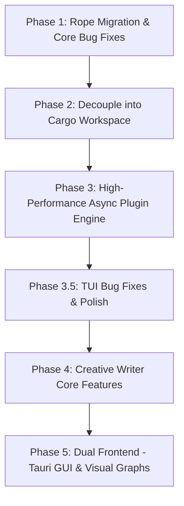

# 🗺️ Master Plan: Yonro Narrative Studio

This document defines the step-by-step technical and architectural evolution of **Yonro** from a tutorial-derived terminal editor into a dedicated, dual-interface (TUI + GUI) narrative studio for creative writers.

---

## 🎯 High-Level Vision & Objectives
1. **Target User**: Creative writers (novelists, short story writers, poets, essayists, worldbuilders).
2. **Dual-Frontend Architecture**:
   - **TUI (Terminal)**: Super-fast, distraction-free, low-latency, battery-friendly terminal interface for flow-state drafting.
   - **GUI (Tauri v2)**: Visual canvas for character relationship graphs, narrative timelines, worldbuilding maps, and rich typography.
3. **Core Tech Shifts**:
   - Storage: Migrate from `Vec<Line>` to a balanced Rope (`ropey`) for $O(\log N)$ edits and $O(1)$ immutable snapshot cloning.
   - Concurrency: Actor-based, non-blocking Tokio plugin bus with debounced snapshots.
   - Prose Engine: Soft word-wrap, typewriter centering, live manuscript stats, and `@mention` lore system.

---

## 📅 Step-by-Step Implementation Phases

---

### ✅ Phase 1: Rope Migration & Core Bug Elimination — **DONE**
*Goal: Solidify the text buffer, eliminate known bugs, and establish rock-solid memory and Unicode safety.*

- [x] **1.1 Integrate `ropey` text rope engine**: Added `ropey = "1.6"`; `Buffer` now uses `Rope` with grapheme-cluster navigation.
- [x] **1.2 Fix Floating Pane Drag Clamping**: Clamped `rect.position.row` to `[1 ..= height.saturating_sub(rect.size.height + 2)]` and `rect.position.col` to `[0 ..= width.saturating_sub(rect.size.width)]` in `editor/handle_resize_command`; prevents drawing over BufferBar (row 0), StatusBar (`height - 2`), CommandBar (`height - 1`).
- [x] **1.3 Fix Cursor EOF Off-by-One**: `View::snap_to_valid_line` now snaps to valid range `0..height - 1`.
- [x] **1.4 Fix `Line::grapheme_idx_to_byte_idx` Boundary Panic**: Returns `self.string.len()` safely at EOL.
- [x] **1.5 Implement Atomic File Saving**: `Buffer::save_to_file` writes to `.tmp`, `sync_all()`, atomic `rename`.
- [x] **1.6 Clean Up Compiler Warnings & Strict Types**: Typed `RemovalResult` enum; unused imports fixed.

---

### ✅ Phase 2: Decouple into Cargo Workspace — **DONE**
*Goal: Separate core narrative engine from terminal presentation layer, laying the foundation for GUI.*

- [x] **2.1 Configure Cargo Workspace**: Root `Cargo.toml` with `members = ["crates/*"]`; `crates/yonro-core`, `crates/yonro-tui`.
- [x] **2.2 Establish Clean Public API Boundaries**: `yonro-core` = Rope buffer, history, grapheme metrics, manuscript tree (stubs), event bus traits. `yonro-tui` = Crossterm loop, terminal drawing, layout tree, floating panes.
- [x] **2.3 Verification**: `cargo test --all` and `cargo check --all` pass.

---

### ✅ Phase 3: High-Performance Async Plugin Engine — **DONE**
*Goal: Fix the sluggish plugin pipeline so multiple background analyzers can run concurrently at 0ms core latency.*

- [x] **3.1 Non-Blocking Core Event Loop**: Replaced blocking `crossterm::event::read` with `poll(Duration::from_millis(16))` (~60fps); loop drains plugin responses every frame.
- [x] **3.2 Actor / Broadcast Plugin Architecture**: `Buffer::rope()` returns `Arc<Rope>` (O(1) clone via ropey COW); `BufferSnapshot` holds `Arc<Rope>`; `PluginRuntime` uses `crossbeam_channel`; worker clones snapshot per plugin (cheap Arc increment).
- [x] **3.3 Direct Keystroke Dispatch**: `MoveHandler` calls `pane.plugin_handle_move()` directly for plugin panes — synchronous, no channel round-trip.

---

### 🔧 Phase 3.5: TUI Bug Fixes & Polish (Blocking Phase 4)
*Goal: Stabilize the TUI before building creative-writer features. All Phase 4 work assumes a solid, bug-free terminal shell.*

#### 3.5.1 Upper Navbar / BufferBar Bugs
- [ ] **BufferBar tab rendering glitch**: Tab labels overflow/overlap when many buffers open; `current_col` arithmetic doesn't account for UTF-8 grapheme width correctly (uses `len()` not `width()`).
- [ ] **BufferBar active tab indicator**: `*` marker position misaligned when tabs scrolled.
- [ ] **BufferBar click handling**: Clicking a tab doesn't focus that buffer; click coordinates not mapped to tab index.

#### 3.5.2 Floating Pane Close/Minimize Button Bugs
- [ ] **Close button (✕) click not registering**: `is_on_close_button` hit-test uses `rect.size.width.saturating_sub(4)` but title bar rendering uses different math; off-by-one on narrow panes.
- [ ] **Minimize button ([-]) click not registering**: Same hit-test issue; `min_button_col` calculation diverges from render position.
- [ ] **Minimize state not persisted correctly**: `is_minimized` toggle works but pane doesn't re-render minimized content on next frame; `needs_redraw` not set.

#### 3.5.3 FileExplorer Dual Rendering Paths (Float vs Static)
- [ ] **Unify rendering**: `FileExplorer::render()` has two code paths — one for floating pane (draws own border + title bar), one for tiled/static (expects pane to draw border). Merge into single `render(rect, is_floating)` or use `PaneContent::Plugin` consistently.
- [ ] **Floating pane drag disappears**: During drag (`dragging_pane` in `Editor`), `FileExplorer` component not re-rendered because `needs_redraw` not triggered; drag offset applied to `Pane.rect` but component's internal scroll/selection state desyncs.
- [ ] **Scroll/selection reset on re-render**: When floating pane re-created or resized, `FileExplorer` loses `selected_idx` and `scroll_offset`.

#### 3.5.4 Floating Pane Drag Clamping (Regression Check)
- [ ] Verify `Editor::handle_resize_command` clamping still works after non-blocking loop refactor: `rect.position.row.clamp(1, max_row)` where `max_row = height - 2 - pane_height`.
- [ ] Ensure drag offset (`drag_offset`) accounted for in clamp so pane doesn't jump on drag start.

#### 3.5.5 Plugin Focus & Input Routing
- [ ] **FileExplorer arrow keys leak to background**: Already fixed in Phase 3.3 via `active_pane_id` filter — verify no regression.
- [ ] **Escape key closes FileExplorer**: Should send `PluginResponse::ClosePane` from `plugin_handle_select` or `on_event`.
- [ ] **Mouse click on floating pane title bar starts drag**: Currently works but `drag_offset` calculation uses absolute mouse position; should be relative to pane top-left.

---

### 🟣 Phase 4: Creative Writer Core Features (Prose Engine)
*Goal: Build the features that make Yonro a joy for novelists, poets, and storytellers.*

- [ ] **4.1 Visual Soft Word-Wrapping**: Dynamic soft-wrapping in `View` at word boundaries to fit viewport width without hard newlines.
- [ ] **4.2 Zen Mode & Typewriter Scrolling**: Centered column (70 chars), typewriter mode (active line at vertical center), fullscreen distraction-free toggle.
- [ ] **4.3 Manuscript Tree Structure**: `Project` → `Acts` → `Chapters` → `Scenes` with metadata (POV, setting, story date/time, target word count).
- [ ] **4.4 System Clipboard Integration**: Cross-platform Copy/Cut/Paste (`Ctrl-C/X/V`) via `arboard`.
- [ ] **4.5 Lore & `@mention` Entity System**: `@` triggers autocomplete for characters/places; links to profiles/lore sheets.

---

### 🟠 Phase 5: Dual Frontend — Tauri GUI & Visual Graphs
*Goal: Unlock visual character maps, timelines, and worldbuilding tools that terminals cannot display.*

- [ ] **5.1 Setup `yonro-gui` (Tauri v2)**: Tauri app connecting to `yonro-core` via Rust IPC / commands.
- [ ] **5.2 Interactive Character Relationship Graph**: Node-link graph of characters/factions; dynamic links showing relationship changes over chapter timelines.
- [ ] **5.3 Narrative Timeline & Geography Travel-Time Checker**: Chronological timeline ruler (story time vs scene order); travel-time validation with soft warnings.

---

## 🐛 Known Issues from `concern.txt` (Archived — Fixed in Phases 1–3)
1. **Missing `PaneOpened` Notification** — Fixed: `apply_plugin_response` now sends `PaneOpened`.
2. **Plugin Keystroke Focus Leakage** — Fixed: `PluginMessage::Event` includes `active_pane_id`; plugins filter by it.
3. **Missing Component Active State Sync** — Fixed: `Pane::set_content_active` propagates to `PluginComponent::set_active`.
4. **Awkward Command Bar Pane Navigation** — Fixed: Prefix shows shorthand; parser accepts bare integer.
5. **Floating Pane Drag Overwrites Status/Command Bars** — Fixed in Phase 1.2 clamping.

---

## 📋 Next Immediate Actions
1. **Start Phase 3.5**: Fix BufferBar, floating pane buttons, FileExplorer rendering unification.
2. **Run `cargo test` after each fix** to prevent regressions.
3. **Only proceed to Phase 4** when TUI is stable (all 3.5.x tasks ✅).