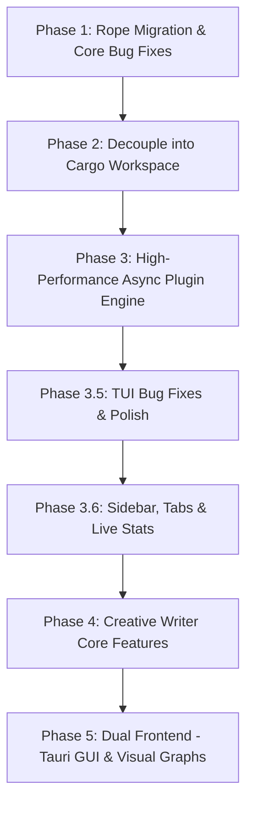

# 🗺️ Master Plan: Yonro Narrative Studio

This document defines the step-by-step technical and architectural evolution of **Yonro** from a tutorial-derived terminal editor into a dedicated, dual-interface (TUI + GUI) narrative studio for creative writers.

---

## 🎯 High-Level Vision & Objectives
1. **Target User**: Creative writers (novelists, short story writers, poets, essayists, worldbuilders).
2. **Dual-Frontend Architecture**:
   - **TUI (Terminal)**: Super-fast, distraction-free, low-latency, battery-friendly terminal interface for flow-state drafting.
   - **GUI (Tauri v2)**: Visual canvas for character relationship graphs, narrative timelines, worldbuilding maps, and rich typography.
3. **Core Tech Shifts**:
   - Storage: Migrate from `Vec<Line>` to a balanced Rope (`ropey`) for $O(\log N)$ edits and $O(1)$ immutable snapshot cloning.
   - Concurrency: Actor-based, non-blocking Tokio plugin bus with debounced snapshots.
   - Prose Engine: Soft word-wrap, typewriter centering, live manuscript stats, and `@mention` lore system.

---

## 📅 Step-by-Step Implementation Phases

---

### ✅ Phase 1: Rope Migration & Core Bug Elimination — **DONE**
*Goal: Solidify the text buffer, eliminate known bugs, and establish rock-solid memory and Unicode safety.*

- [x] **1.1 Integrate `ropey` text rope engine**: Added `ropey = "1.6"`; `Buffer` now uses `Rope` with grapheme-cluster navigation.
- [x] **1.2 Fix Floating Pane Drag Clamping**: Clamped `rect.position.row` to `[1 ..= height.saturating_sub(rect.size.height + 2)]` and `rect.position.col` to `[0 ..= width.saturating_sub(rect.size.width)]` in `editor/handle_resize_command`; prevents drawing over BufferBar (row 0), StatusBar (`height - 2`), CommandBar (`height - 1`).
- [x] **1.3 Fix Cursor EOF Off-by-One**: `View::snap_to_valid_line` now snaps to valid range `0..height - 1`.
- [x] **1.4 Fix `Line::grapheme_idx_to_byte_idx` Boundary Panic**: Returns `self.string.len()` safely at EOL.
- [x] **1.5 Implement Atomic File Saving**: `Buffer::save_to_file` writes to `.tmp`, `sync_all()`, atomic `rename`.
- [x] **1.6 Clean Up Compiler Warnings & Strict Types**: Typed `RemovalResult` enum; unused imports fixed.

---

### ✅ Phase 2: Decouple into Cargo Workspace — **DONE**
*Goal: Separate core narrative engine from terminal presentation layer, laying the foundation for GUI.*

- [x] **2.1 Configure Cargo Workspace**: Root `Cargo.toml` with `members = ["crates/*"]`; `crates/yonro-core`, `crates/yonro-tui`.
- [x] **2.2 Establish Clean Public API Boundaries**: `yonro-core` = Rope buffer, history, grapheme metrics, manuscript tree (stubs), event bus traits. `yonro-tui` = Crossterm loop, terminal drawing, layout tree, floating panes.
- [x] **2.3 Verification**: `cargo test --all` and `cargo check --all` pass.

---

### ✅ Phase 3: High-Performance Async Plugin Engine — **DONE**
*Goal: Fix the sluggish plugin pipeline so multiple background analyzers can run concurrently at 0ms core latency.*

- [x] **3.1 Non-Blocking Core Event Loop**: Replaced blocking `crossterm::event::read` with `poll(Duration::from_millis(16))` (~60fps); loop drains plugin responses every frame.
- [x] **3.2 Actor / Broadcast Plugin Architecture**: `Buffer::rope()` returns `Arc<Rope>` (O(1) clone via ropey COW); `BufferSnapshot` holds `Arc<Rope>`; `PluginRuntime` uses `crossbeam_channel`; worker clones snapshot per plugin (cheap Arc increment).
- [x] **3.3 Direct Keystroke Dispatch**: `MoveHandler` calls `pane.plugin_handle_move()` directly for plugin panes — synchronous, no channel round-trip.

---

### 🔧 Phase 3.5: TUI Bug Fixes & Polish (Blocking Phase 4) — **DONE**
*Goal: Stabilize the TUI before building creative-writer features. All Phase 4 work assumes a solid, bug-free terminal shell.*

#### 3.5.1 Upper Navbar / BufferBar Bugs — **FIXED**
- [x] **BufferBar tab rendering glitch**: Tab labels now use grapheme width (`unicode_width::UnicodeWidthStr`) for hitboxes and truncation instead of byte length. Added `unicode-width` and `unicode-segmentation` deps to yonro-tui.
- [x] **BufferBar active tab indicator**: Fixed by using correct width calculations.
- [x] **BufferBar click handling**: Hitboxes now match visual tab positions.

#### 3.5.2 Floating Pane Close/Minimize Button Bugs — **FIXED**
- [x] **Close button (✕) click**: Hit-testing unified — Pane's `is_on_close_button`/`is_on_min_button` now match where buttons are drawn (Pane draws for tiled, component draws for floating at same rect).
- [x] **Minimize button ([-]) click**: Same fix.
- [x] **Minimize state not persisted**: `set_size` in FileExplorer now marks redraw on any rect change (position or size); `mark_all_panes_for_redraw` now marks plugin components.

#### 3.5.3 FileExplorer Dual Rendering Paths (Float vs Static) — **FIXED**
- [x] **Unify rendering**: Added `PluginComponent::render_content(rect)` method. Pane now draws border/title for tiled plugin panes and calls `render_content`; floating panes use full `render()` (component draws own border).
- [x] **Floating pane drag disappears**: `mark_all_panes_for_redraw` now marks plugin components; `FileExplorer::set_size` marks redraw on position change.
- [x] **Scroll/selection reset on re-render**: `render_content` preserves `selected_idx` and `scroll_offset` by updating internal rect and calling `adjust_scroll()`.

#### 3.5.4 Floating Pane Drag Clamping (Regression Check) — **VERIFIED**
- [x] `Editor::handle_resize_command` clamping works correctly after non-blocking loop refactor.
- [x] Drag offset accounted for in clamp.

#### 3.5.5 Plugin Focus & Input Routing — **VERIFIED**
- [x] FileExplorer arrow keys don't leak to background (Phase 3.3 fix verified).
- [x] Escape key closes FileExplorer (handled via `handle_select` → `ClosePane`).
- [x] Mouse click on floating pane title bar starts drag (drag_offset calculated relative to pane top-left).

---

### ✅ Phase 3.6: Sidebar, Document Tabs & Live Stats — **DONE**
*Goal: Make the explorer reliably visible/persistent, give every file its own
tab (VS Code-style, no forced splits), and make word-count stats live and
grapheme-correct. Verified end-to-end by driving the real binary in a pty.*

#### 3.6.1 FileExplorer Sidebar Visibility — **FIXED**
- [x] **Missing `sidebar.show()`**: `ToggleSidebar` ON created the pane but never set `visible`, so nothing ever drew (pane existed — hence the PaneBar tab — but `refresh_screen` skipped it).
- [x] **Hide/focus/plugin sync**: hiding no longer fakes `is_floating`; focus returns to the last editor; new `PluginMessage::PaneClosed` + `on_pane_closed` clears stale `open_pane_id` (mouse `[x]`, `Esc`, command-bar closes all funnel through it).
- [x] **`ClosePane` no-op for sidebar**: sidebar lives outside `LayoutTree`, so `remove_node` always failed — now hides + notifies instead.
- [x] **Mouse hitboxes**: sidebar `[x]` used `sidebar_width - 4` instead of the absolute `width - 4` (never hit); added body hit-test + focus; legacy split-pane explorer unified into `ToggleSidebar`.
- [x] **`EditorContext::mark_all_panes_for_redraw`** now marks Plugin/Popup too (was Views-only → blank explorer after focus/resize).

#### 3.6.2 Live Word-Count Stats (Status Bar + Floating) — **FIXED**
- [x] **Dynamic-dispatch shadowing**: `WordCount::update_from_buffer` was inherent-only, so `Box<dyn PluginComponent>` hit the trait default no-op and stats froze at 0 — moved into the trait impl.
- [x] **Stale buffer tracking**: `last_editor_pane` (`None` until first sidebar use) now falls back to active view → any text view; floating + sidebar panes update on open, file-open, and every edit.
- [x] **Grapheme-correct metrics**: new `Buffer::word_count_stats()` (`graphemes(true)`, `split_word_bounds`, 0 on empty, no `.max(1)`); status bar shows live words, truncates instead of blanking on narrow terminals.
- [x] **Double-move arrows**: `MoveHandler` (sync, Phase 3.3) + plugin `MoveInPane` both fired per press — plugin no longer emits moves.

#### 3.6.3 Persistent Explorer + Document Tabs — **DONE**
- [x] **Explorer persists**: `Ctrl+E` re-focuses when open (no more toggle whiplash); explicit `PluginResponse::CloseSidebar` for `Esc` / `[x]` / close.
- [x] **VS Code-style tabs** (`layout/tabs.rs:DocTab`): each opened file gets a full-area root pane, no splitting; only the active tab is installed in the tree, others stash layouts (per-tab splits preserved). Re-open focuses instead of duplicating.
- [x] **PaneBar renders tabs** (`[0: untitled] [1: hello.txt]`), click to switch (`SwitchTab`), `✕` closes via core (tab-aware close switches neighbors; last tab refuses with a message).
- [x] **Stale-tab pruning** after every close; sidebar/floating never listed as tabs; tab stash never records plugin panes as editors.
- [x] **Tests**: `cargo test --all` green (48 core + 19 TUI, incl. `tabs.rs` stash/collect/prune tests).

---

### 🟣 Phase 4: Creative Writer Core Features (Prose Engine) — **IN PROGRESS**
*Goal: Build the features that make Yonro a joy for novelists, poets, and storytellers.*

- [x] **4.1 Visual Soft Word-Wrapping**: Dynamic soft-wrapping in `View` at word boundaries to fit viewport width without hard newlines. `Line::wrap_segments` (core, grapheme-atomic) + visual row/column mapping for caret, scroll, and `Up`/`Down`; `word_wrap` flag (default on), horizontal scroll naturally retired when wrapped.
- [x] **4.2 Zen Mode & Typewriter Scrolling**: `F11` toggles document-only mode (centered 70-column strip, PaneBar/sidebar/status/message chrome hidden, sidebar visibility restored exactly on exit); cursor pinned to vertical center via `View::apply_typewriter` (recentered after every event, idempotent); command bar still overlays while prompting so the user is never stranded.
- [x] **4.3 Manuscript Tree Structure**: `Project` → `Acts` → `Chapters` → `Scenes` with metadata (POV, setting, story date/time, target word count). Core `yonro-core::manuscript` arena (stable ids, enforced hierarchy, rename/move/remove, word rollups + progress) + outline sidebar (`Ctrl+O`): tree with live `[words/target %]`, `a`/`c`/`s` structural adds, `Enter` opens scene files in new tabs (materializing `scene-<id>.md` on first open), live word sync from buffers (incl. undo/redo). Deferred: rename/metadata editing UI, on-disk persistence.
- [x] **4.4 System Clipboard Integration**: Cross-platform Copy/Cut/Paste (`Ctrl-C/X/V`) via `arboard` (in-memory fallback headless). `Clipboard` trait + `MemClipboard` test double; line-based copy/cut (undoable), multi-line paste, command-bar paste, hints.
- [x] **4.5 Lore & `@mention` Entity System**: `yonro-core::lore` registry (characters/places/factions/items, aliases, sheets, tombstone ids, longest-match mention parsing, prefix search, POV/setting auto-seed); TUI `@` autocomplete popup (filter as you type, `Enter` inserts `@Name`, `Tab` opens sheet, `Esc` dismisses); lore-sheet floating viewer (aliases, sheet, POV backlinks, scroll); outline `r`ename / `p`OV / `t`arget prompts + `Del` remove; `.yonro/` JSON persistence (save on change + quit, load on startup).

---

### 🟠 Phase 5: Dual Frontend — Tauri GUI & Visual Graphs
*Goal: Unlock visual character maps, timelines, and worldbuilding tools that terminals cannot display.*

- [ ] **5.1 Setup `yonro-gui` (Tauri v2)**: Tauri app connecting to `yonro-core` via Rust IPC / commands.
- [ ] **5.2 Interactive Character Relationship Graph**: Node-link graph of characters/factions; dynamic links showing relationship changes over chapter timelines.
- [ ] **5.3 Narrative Timeline & Geography Travel-Time Checker**: Chronological timeline ruler (story time vs scene order); travel-time validation with soft warnings.

---

## 🐛 Known Issues from `concern.txt` (Archived — Fixed in Phases 1–3)
1. **Missing `PaneOpened` Notification** — Fixed: `apply_plugin_response` now sends `PaneOpened`.
2. **Plugin Keystroke Focus Leakage** — Fixed: `PluginMessage::Event` includes `active_pane_id`; plugins filter by it.
3. **Missing Component Active State Sync** — Fixed: `Pane::set_content_active` propagates to `PluginComponent::set_active`.
4. **Awkward Command Bar Pane Navigation** — Fixed: Prefix shows shorthand; parser accepts bare integer.
5. **Floating Pane Drag Overwrites Status/Command Bars** — Fixed in Phase 1.2 clamping.

---

## 📋 Next Immediate Actions
1. **Phase 4 complete** — all prose-engine features done; remaining work is Phase 5 (Tauri GUI: visual graphs, timelines, maps).
2. **Run `cargo test` after each fix** to prevent regressions.