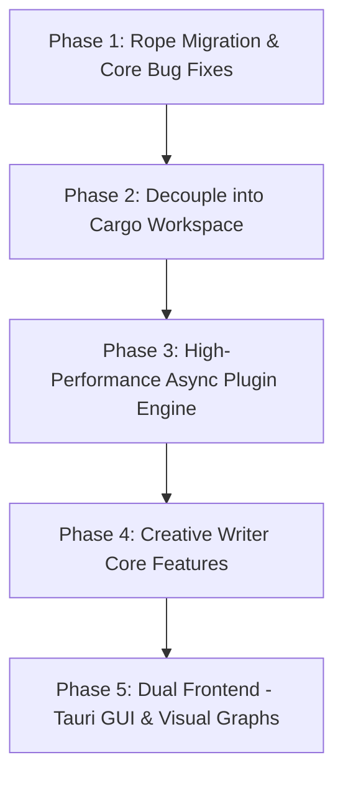

# 🗺️ Master Plan: Yonro Narrative Studio

This document defines the step-by-step technical and architectural evolution of **Yonro** from a tutorial-derived terminal editor into a dedicated, dual-interface (TUI + GUI) narrative studio for creative writers.

---

## 🎯 High-Level Vision & Objectives
1. **Target User**: Creative writers (novelists, short story writers, poets, essayists, worldbuilders).
2. **Dual-Frontend Architecture**:
   - **TUI (Terminal)**: Super-fast, distraction-free, low-latency, battery-friendly terminal interface for flow-state drafting.
   - **GUI (Tauri v2)**: Visual canvas for character relationship graphs, narrative timelines, worldbuilding maps, and rich typography.
3. **Core Tech Shifts**:
   - Storage: Migrate from `Vec<Line>` to a balanced Rope (`ropey`) for $O(\log N)$ edits and $O(1)$ immutable snapshot cloning.
   - Concurrency: Actor-based, non-blocking Tokio plugin bus with debounced snapshots.
   - Prose Engine: Soft word-wrap, typewriter centering, live manuscript stats, and `@mention` lore system.

---

## 📅 Step-by-Step Implementation Phases

---

### 🟢 Phase 1: Rope Migration & Core Bug Elimination
*Goal: Solidify the text buffer, eliminate known bugs, and establish rock-solid memory and Unicode safety.*

- [ ] **1.1 Integrate `ropey` text rope engine**:
  - Add `ropey = "1.6"` to `Cargo.toml`.
  - Replace `lines: Vec<Line>` in `Buffer` with `Rope` while preserving grapheme-cluster navigation and display width checks.
  - Benchmark performance improvements against the existing `benches/buffer_benchmarks.rs`.
- [ ] **1.2 Fix Floating Pane Drag Clamping (Flagged in `concern.txt`)**:
  - In `src/editor/command_dispatcher/handlers/mouse.rs`, clamp `rect.position.row` to `[1 ..= height.saturating_sub(rect.size.height + 2)]`.
  - Clamp `rect.position.col` to `[0 ..= width.saturating_sub(rect.size.width)]`.
  - Prevent floating panes from drawing over the `BufferBar` (row 0), `StatusBar` (`height - 2`), or `CommandBar` (`height - 1`).
- [ ] **1.3 Fix Cursor EOF Off-by-One**:
  - In `View::snap_to_valid_line`, change `min(self.text_location.line_idx, buffer.height())` to snap to valid existing line range (`0..height - 1`, or 0 if empty), eliminating phantom blank lines after EOF.
- [ ] **1.4 Fix `Line::grapheme_idx_to_byte_idx` Boundary Panic**:
  - Handle `grapheme_idx == self.grapheme_count()` by returning `self.string.len()` safely instead of triggering debug panic.
- [ ] **1.5 Implement Atomic File Saving**:
  - In `Buffer::save_to_file`, write to a temporary file (`.filename.tmp`) in the same directory, flush to disk with `sync_all()`, and atomically rename (`fs::rename`) to prevent 0-byte file truncation.
- [ ] **1.6 Clean Up Compiler Warnings & Strict Types**:
  - Replace `Err(Error::other("DELETED"))` in `LayoutTree::remove_node_recursive` with a typed `enum RemovalResult`.
  - Fix unused imports in `events/mod.rs`, `panemanager.rs`, `plugins/mod.rs`, and `plugin_component.rs`.

---

### 🟡 Phase 2: Decouple into Cargo Workspace
*Goal: Separate core narrative engine from terminal presentation layer, laying the foundation for GUI.*

- [ ] **2.1 Configure Cargo Workspace**:
  - Root `Cargo.toml` with `[workspace] members = ["crates/*"]`.
  - Move headless engine into `crates/yonro-core`.
  - Move terminal rendering, Crossterm interactions, and layouts into `crates/yonro-tui`.
- [ ] **2.2 Establish Clean Public API Boundaries**:
  - `yonro-core` contains:
    - Text Buffer (Rope), History (Undo/Redo), Grapheme metrics.
    - Manuscript project structure (Acts, Chapters, Scenes, Metadata).
    - Event bus and plugin runtime traits.
  - `yonro-tui` contains:
    - Crossterm event loop, Terminal drawing, Tiled binary layout tree, Floating panes.
- [ ] **2.3 Verification**:
  - Ensure `cargo test --all` and `cargo check --all` pass seamlessly.

---

### 🔵 Phase 3: High-Performance Async Plugin Engine
*Goal: Fix the sluggish plugin pipeline so multiple background analyzers can run concurrently at 0ms core latency.*

- [ ] **3.1 Non-Blocking Core Event Loop**:
  - Replace blocking `crossterm::event::read` with a non-blocking `crossterm::event::poll(Duration::from_millis(16))` loop or crossbeam event channel.
  - Enable the core loop to drain background plugin responses immediately without waiting for user keystrokes.
- [ ] **3.2 Actor / Broadcast Plugin Architecture**:
  - Leverage $O(1)$ Rope cloning: background workers receive `Arc<Rope>` or `RopeSnapshot` without deep copying.
  - Dedicated background workers for:
    - Live word / character / reading time counters.
    - Grammar / spelling / pacing analyzers.
    - Character `@mention` extractors.
- [ ] **3.3 Direct Keystroke Dispatch**:
  - Route navigation keystrokes directly in `MoveHandler` to active plugin components without round-tripping through background channels.

---

### 🟣 Phase 4: Creative Writer Core Features (Prose Engine)
*Goal: Build the features that make Yonro a joy for novelists, poets, and storytellers.*

- [ ] **4.1 Visual Soft Word-Wrapping**:
  - Implement dynamic soft-wrapping in `View`: wrap lines at word boundaries to fit viewport width without inserting hard newlines into the document.
- [ ] **4.2 Zen Mode & Typewriter Scrolling**:
  - Centered text column with comfortable writing margins (e.g. 70 characters wide).
  - Typewriter mode: keeps the active writing line fixed at vertical center.
  - Fullscreen distraction-free toggle: hide UI chrome when typing.
- [ ] **4.3 Manuscript Tree Structure**:
  - Support multi-file narrative projects: `Project` $\rightarrow$ `Acts` $\rightarrow$ `Chapters` $\rightarrow$ `Scenes`.
  - Scene metadata: POV character, setting/location, story date/time, target word count.
- [ ] **4.4 System Clipboard Integration**:
  - Full cross-platform Copy/Cut/Paste (`Ctrl-C`, `Ctrl-X`, `Ctrl-V`) using the `arboard` crate.
- [ ] **4.5 Lore & `@mention` Entity System**:
  - Typing `@` triggers entity autocompletion for characters and places.
  - Links text directly to character profiles and worldbuilding lore sheets.

---

### 🟠 Phase 5: Dual Frontend — Tauri GUI & Visual Graphs
*Goal: Unlock visual character maps, timelines, and worldbuilding tools that terminals cannot display.*

- [ ] **5.1 Setup `yonro-gui` (Tauri v2)**:
  - Create Tauri app connecting to `yonro-core` via Rust IPC / commands.
- [ ] **5.2 Interactive Character Relationship Graph**:
  - Node-link visual graph of characters and factions.
  - Dynamic links showing changing relationships over chapter timelines (e.g., *Friends $\rightarrow$ Rivals*).
- [ ] **5.3 Narrative Timeline & Geography Travel-Time Checker**:
  - Chronological timeline ruler comparing story time vs narrative scene order.
  - Travel-time validation: soft warnings when characters travel faster than world geography allows.
