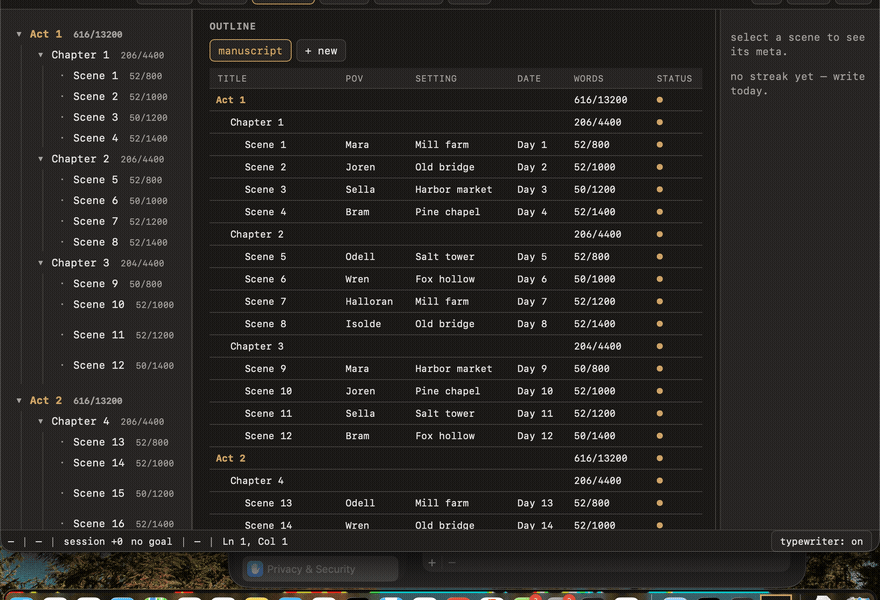
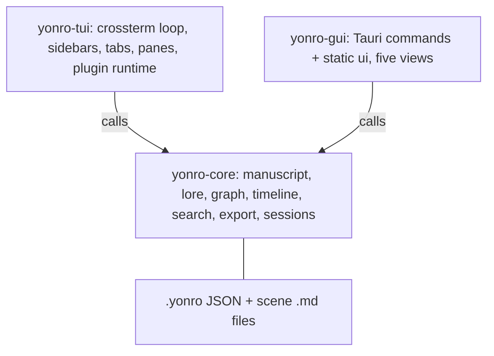

# Yonro — a narrative studio for fiction writers

[](https://github.com/akshayrivers/Text_Editor/actions/workflows/rust.yml)

Yonro is a **prototype** novel-writing studio: one headless narrative engine
(`yonro-core`) with two frontends over the same workspace on disk — a terminal
UI (`yonro-tui`) for distraction-free drafting, and a desktop app (`yonro-gui`,
Tauri v2) for outline, relationship graph, timeline, and lore. It started life
as a Hecto-tutorial terminal editor; the manuscript, lore, graph, and session
features are what it is now. The author is writing a novel inside it.


## demos

### terminal — outline sidebar, explorer, find, zen mode


Scripted pty session on a seeded sample novel: toggles the outline sidebar
(`Ctrl-O`), opens a scene into a new tab, browses the file explorer (`Ctrl-E`),
runs find, toggles zen mode (`F11`), and quits. Recorded with
[asciinema](https://docs.asciinema.org/) and rendered with `agg`
(`assets/tui.cast` keeps the raw recording).

### desktop — write, outline, graph, timeline, lore


Screen capture of `cargo run -p yonro-gui -- <seeded workspace>`, cycling the
five views over the same sample novel (30 entities, so the graph stays
readable). Views are driven in order: Write, Outline, Graph, Timeline, Lore.


## what each crate does

### `yonro-core` — the engine (no UI)
Headless Rust library with zero UI dependencies. It computes every narrative
fact; frontends only render. Contents:

- manuscript tree: acts, chapters, scenes, word targets, progress rollups
- rope text buffers (`ropey`) with grapheme-correct word counts and undo
- lore book: entities, aliases, `@mention` parsing
- relationship graph from mention co-occurrence, plus saved lenses and an
  act-presence table
- timeline plus continuity notes
- project-wide search, manuscript export, history snapshots and recovery
- session log: words per day, streaks, goals
- alternate outline trees and hand-drawn custom graph canvases

### `yonro-tui` — the terminal frontend
A `crossterm` event loop over `yonro-core`: outline/binder sidebar (`Ctrl-O`),
file-explorer sidebar (`Ctrl-E`), document tabs, `@mention` autocomplete with
lore sheets, find, zen/typewriter mode, live word counts, mouse support, split
and floating panes with a command bar, and an async plugin runtime that hosts
the sidebars without blocking key input.

### `yonro-gui` — the desktop frontend (Tauri v2)
The same core and the same files, behind five views: **Write**
(drafting with `@mention` autocomplete), **Outline** (manuscript table plus
alternate outlines), **Graph** (inferred relationships, custom canvases,
lenses), **Timeline** (scene order plus continuity notes), and **Lore**
(entity sheets, aliases, backlinks) — plus command palette, inspector,
session bar, and export. Only `crates/yonro-gui/ui/core.js` touches
`window.__TAURI__`; the rest is dependency-free static JS (no npm, no
bundler, no framework).


## on-disk format

Both frontends read and write the same workspace:

```text
<root>/.yonro/{manuscript.json, lore.json, ...}
<root>/scene-<id>.md
```

New files under `.yonro/` may appear; existing JSON shapes only gain optional
fields. Missing or corrupt JSON falls back to Untitled/empty — never a crash.


## quick start

Requirements: stable Rust. The desktop app on Linux also needs the
WebKitGTK stack (see `.github/workflows/rust.yml`).

```bash
git clone https://github.com/akshayrivers/Text_Editor.git
cd Text_Editor

# terminal editor (reads the .yonro workspace in <cwd>)
cargo run -p yonro-tui

# desktop studio (paths resolve under your home folder)
cargo run -p yonro-gui -- <workspace_dir>

# sample novel (3 acts, 36 scenes, @mentions) for trying the views/graph
cargo run -p yonro-core --example seed -- /tmp/y --entities 250
```

New projects open on a ready-to-write skeleton (Act I / Chapter 1 / Scene 1).
The GUI keymap: press `?` outside the editor for the shortcut sheet, or run
palette `>keyboard shortcuts`. The full map lives in `AGENTS.md` under KEYMAP.


## keybindings (tui)

- `Ctrl-S` save · `Ctrl-Q` quit (repeats to force when dirty) · `Ctrl-F` find
- `Ctrl-Z` undo · `Ctrl-R` redo · `Ctrl-C`/`X`/`V` clipboard
- `Ctrl-E` explorer sidebar · `Ctrl-O` outline sidebar · `Ctrl-H` split pane
- `Ctrl-Space` command bar (`focus <id>`, `close`, `float`, `unfloat`, `explore`)
- `F11` (or double `Ctrl-Z`) zen/typewriter mode · `Esc` dismiss or close panel

With the outline focused: arrows navigate · `Enter` opens the scene in a new
tab · `a` / `c` / `s` add act / chapter / scene · `r` rename · `p` POV ·
`t` word target · `Delete` removes the node (scene files are kept). Typing
`@` in the editor offers lore autocomplete (`Enter` inserts, `Tab` shows the
lore sheet, `Esc` dismisses). Splits also resize by dragging dividers.


## architecture



`yonro-core` never touches a screen; both frontends never derive a narrative
fact. Details live in `architecture.md` (TUI loop, plugin messages, layout
tree, and the full Tauri command list behind `ui/core.js`).


## license

MIT. Started from the Hecto tutorial: https://www.flenker.blog/hecto/
