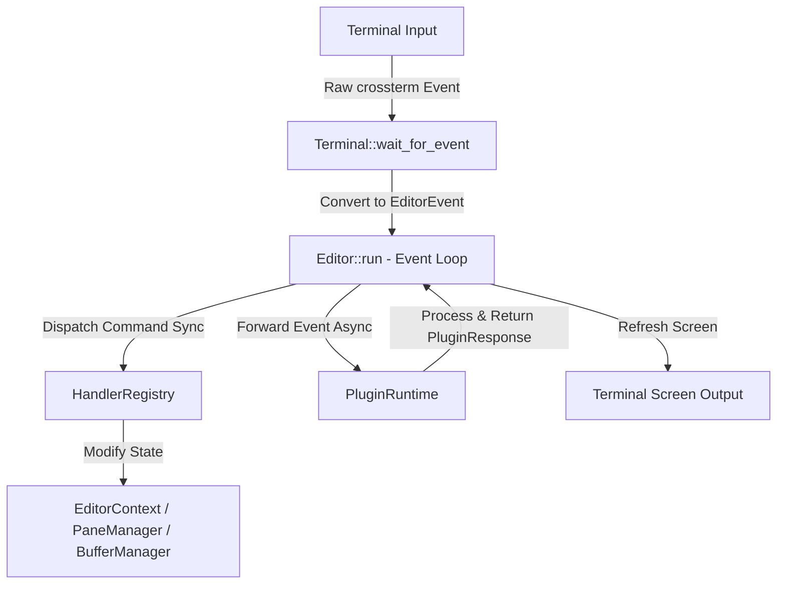
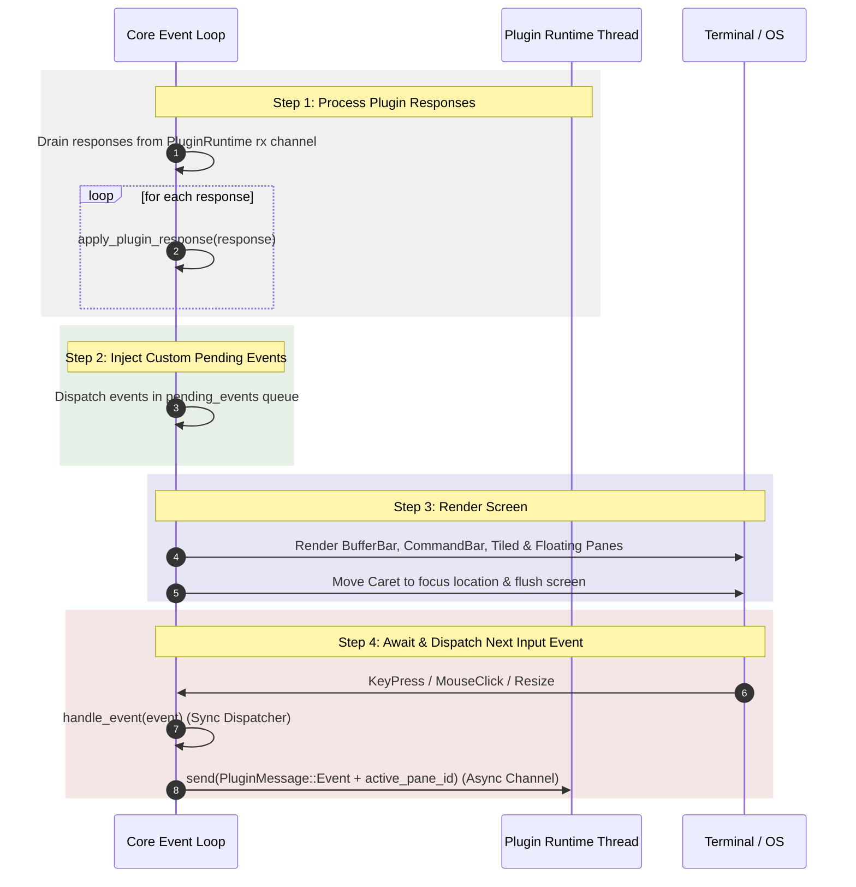
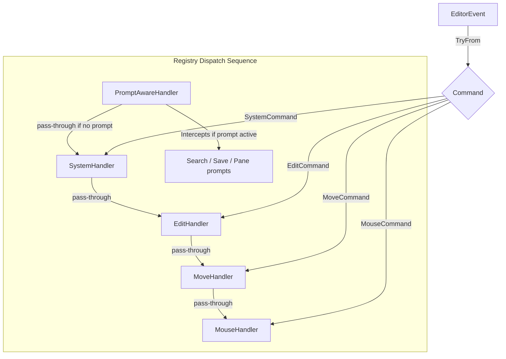
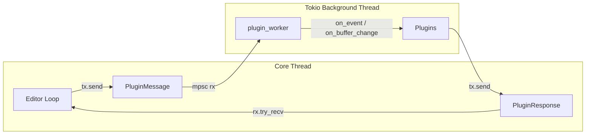
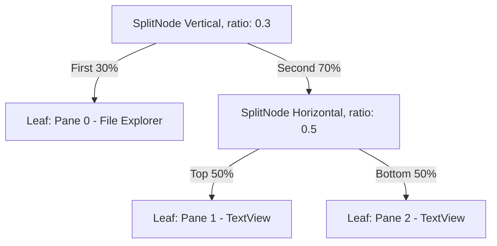

# Yonro Text Editor: Architecture & Plugin Workflow

This document provides a detailed overview of the Yonro text editor's architecture, including clear flow diagrams for input handling, the command dispatcher, the layout tree split system, and the background plugin architecture. It also lists the bugs identified and fixed.

## 1. General Architecture Overview
Yonro uses a **Layered Architecture** designed to keep the core terminal rendering and input loop highly responsive and synchronous, while extending capabilities (like the File Explorer) through an asynchronous **Plugin Runtime**.

## 2. The Main Event Loop Flow

The `Editor::run` event loop runs continuously on the main thread, completing four steps in each cycle:

## 3. Command Dispatcher Flow

Keystrokes and mouse events are converted from Crossterm-specific events into `EditorEvent`s and then into `Command`s. The `HandlerRegistry` dispatches these command objects to registered handler traits.

## 4. Plugin Architecture and Messaging

The plugin runtime runs on its own background thread powered by a single-threaded Tokio runtime. Communication is done entirely through asynchronous `std::sync::mpsc` channels.

### Message Flow Diagram

### Messaging Protocol

*   **`PluginMessage` (Core $\rightarrow$ Plugins)**:
    *   `LoadPlugin(Box<dyn Plugin>)`: Dynamically loads a plugin into the worker.
    *   `Event { event, active_pane_id }`: Relays key, mouse, and resize events along with the current focused pane ID.
    *   `BufferChanged(BufferSnapshot)`: Sent whenever a text buffer is modified.
    *   `PaneOpened { plugin_name, pane_id }`: Notifies a plugin that a pane it requested was successfully opened by the core.
    *   `Shutdown`: Triggers dynamic unloading of all plugins.
*   **`PluginResponse` (Plugins $\rightarrow$ Core)**:
    *   `OpenFloatingPane`: Requests a new window for custom UI.
    *   `ClosePane` / `ToggleMinimize`: Resizes or dismisses panes.
    *   `MoveInPane` / `SelectInPane` / `MouseClickInPane`: Intercepts and delegates actions to custom components.
    *   `UpdateMessage`: Writes text to the editor message bar.

## 5. GUI adapter seam (`yonro-gui`)

All narrative facts are computed in `yonro-core`; the Tauri frontend only renders. The seam is the `#[tauri::command]` set in `crates/yonro-gui/src/main.rs` — the single list a future pure-web build reimplements over WASM:

`get_outline` / `get_stats` / `get_lore` / `get_workspace` / `open_workspace` / `create_workspace` / `open_file` / `set_text` / `save_file` / `close_buffer` / `undo_buffer` / `redo_buffer` / `get_graph` / `get_timeline` / `add_node` / `rename_node` / `move_node` / `remove_node` / `set_scene_meta` / `get_scene` / `open_scene` / `list_files` / `add_entity` / `update_entity` / `remove_entity` / `lore_search` / `get_entity` / `get_mentions` / `search_buffer` / `search_project` / `get_session` / `set_goal` / `export_manuscript` / `get_history` / `restore_snapshot` / `sweep_recovery` / `check_recovery` / `discard_recovery` (plus `get_workspace_dir`).

Only `crates/yonro-gui/ui/core.js` touches `window.__TAURI__`. Every other file calls `core.<fn>()`.

`ui/` file layout (classic `<script>` files, loaded in order, no modules/bundler):

- `index.html` — shell: topnav tablist, binder/inspector drawers, five `tabpanel` views, palette/find/prose overlays, statusline with `aria-live` slot.
- `theme.js` / `themes.css` — theme choice + all color tokens (only file with hex colors).
- `styles.css` — layout only, `var(--token)` colors.
- `core.js` — adapter seam (above).
- `util.js` — `esc`, `isMod`, `el`, `debounce`, `setMessage`, `errText`, `openModal`.
- `app.js` — shell boot, `COMMANDS` registry (palette `>` mode + shortcut-sheet source), view switching (lazy per-view loads), global keymap, drawers, zen.
- `editor.js` — write view: local dirty flag + debounced `set_text` sync, tabs, find/highlight backdrop, `@` autocomplete, save flows, recovery.
- `outline.js` — outline table + binder tree (roving tabindex, inline add/rename/remove, context menu, files section).
- `graph.js` — SVG relationship graph (layout in JS, facts from core), spotlight + keyboard walk.
- `timeline.js` — chapter-grouped entries + continuity cards, POV filter (UI-only).
- `lore.js` — entity list + detail (aliases, sheet, scene links), add/delete dialogs.
- `inspector.js` — selection inspector (scene meta form, entity sheet, history + restore).
- `workspace.js` — start screen, workspace switch/create, warnings banner.
- `palette.js` — `<dialog>` command palette (scenes/files, `>` commands, `@` entities, `/` project search).
- `find.js` — find bar over `search_buffer` spans.
- `session.js` — session bar/streaks + goal dialog.
- `export.js` — export flows with receipt message.

## 6. Layout Tree and Pane Management

Yonro uses a **Binary Layout Tree** representing tiled windows. Splits are vertical or horizontal.

### Window Management Flow (Floating, Minimizing, Resizing)

*   **Splitting Tiled Panes**: When a split command is executed, the leaf node is replaced by a split node containing two leaves (original pane and a new pane).
*   **Floating Panes**: Float panes are managed by `PaneManager` directly rather than being inside the `LayoutTree`. They are drawn on layer 10+ sorted by `z-index`.
*   **Split Dragging**: A click inside the tolerance zone of a divider registers a `dragging_split` handle. Dragging adjusts the split ratio, triggering `handle_resize` to recalculate all layouts.